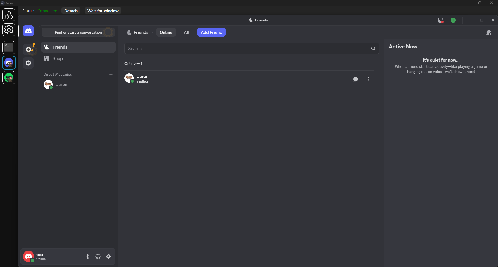

# [Nexus](https://github.com/aarontburn/nexus-core): Discord Monkey

    

A module for [Nexus](https://github.com/aarontburn/nexus-core) to "embed" Discord as a Nexus module...

And by "embed", this just takes the Discord window and monkeys it around.

 

## Required Dependencies
[Monkey Core](https://github.com/aarontburn/nexus-monkey-core)

## Installation
1. Download the latest release `.zip`. 
2. In Nexus, navigate to **Settings** > **Import Module**
3. Select the downloaded `.zip` file to install.

## Limitations:
- Discord notifications will appear, but this will hide the red bubble.
